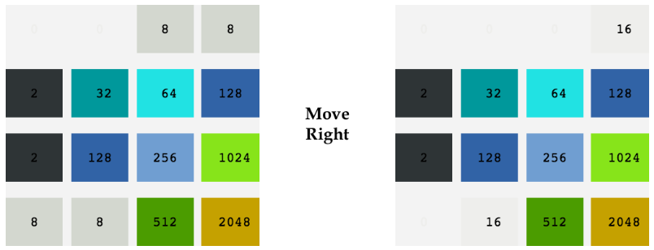

# AI-2048-puzzle
<b>An agent using heuristics to play the 2048-puzzle game against an adversarial computer</b>

The 2048-puzzle game is played on a 4×4 grid, with numbered tiles that slide in all four directions (up, down, left, right) when a player moves them. At every turn, the computer will randomly place a new tile in an empty spot on the board, with a value of either 2 or 4 (with 0.9 and 0.1 probability respectively).

All tiles on the grid slide as far as possible in that direction, until they either (1) collide with another tile, or (2) collide with the edge of the grid. If two tiles of the same number collide while moving, they will merge into a single tile, valued at the sum of the two original tiles that collided.

  

Play the game [here](https://play2048.co/).

## Assumptions and constraints

1. Although this is not technically so, it will be useful for us to assume the <b>Player AI</b> to play as if the <b>computer is completely adversarial</b>.
2. The Player AI has a <b>time limit allowed</b> for each move of <b>0.2 seconds</b>.
3. The <b>minimax algorithm</b> is used. The strategy assumes that the computer opponent is perfect in minimizing the player's outcome.
4. <b>Alpha-beta pruning</b> is used to speed up the search process by eliminating irrelevant branches.
5. <b>Heuristic functions</b> are used to assign approximate values to nodes in the tree and <b>heuristic weights</b> to leverage multiple functions. Some useful insights can be found in this [paper](http://cs229.stanford.edu/proj2016/report/NieHouAn-AIPlays2048-report.pdf).

## Heuristics

Two main features of the given game board grid are taken into account in the current implementation:

1. <b>Logaritmic improvement</b> from the current maximum tile value to the expected maximum after selected move. A <b>base 2</b> logarithm is used as these allows us to create a linear progression between tile numbers (2 = 2^1, 4 = 2^2, 8 = 2^8,... 2048 = 2^11, ...) and not overweight increases in higher tile values.
2. <b>Number of available cells</b> in the board grid. It imposes kind of a reward or penalty on current boardas the more empty tiles, the more likely to last longer until game terminates.

## Code structure

- <code>GameManager.py</code>. Driver program that loads your Computer AI and Player AI, and begins a game where they compete with each other. See below on how to execute this program.
- <code>Grid.py</code>. This module defines the Grid object, along with some useful operations: <code>move(), getAvailableCells(), insertTile(), and clone()</code>.
- <code>BaseAI.py</code>. This is the base class for any AI component. All AIs inherit from this module, and implement the getMove() function, which takes a Grid object as parameter and returns a move (there are different "moves" for different AIs).
- <code>ComputerAI.py</code>. This inherits from BaseAI. The <code>getMove()</code> function returns a computer action that is a tuple (x, y) indicating the place you want to place a tile.
- <code>PlayerAI.py</code>. This inherits from BaseAI. The <code>getMove()</code> function, returns a number that indicates the player’s action chosen using the minimax algorithm with alpha-beta pruning and the heuristics specified above. In particular, 0 stands for "Up", 1 stands for "Down", 2 stands for "Left", and 3 stands for "Right".
- <code>BaseDisplayer.py</code> and <code>Displayer.py</code>. These print the grid.

### Running the code

Use the following command to start a 2048-puzzle game:

<code>$ python3 GameManager.py</code>
